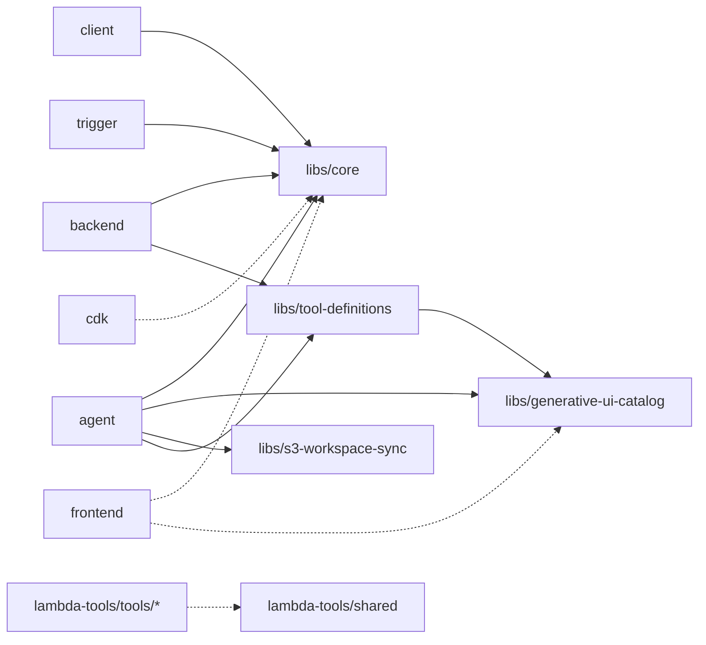

# Build / Monorepo Design Rationale

Why the current build and monorepo layout look the way they do. Only non-obvious constraints that an agent or engineer would predictably violate without this note.

---

## 1. TypeScript

### 1.0 Configuration map

Three independent relationships connect the tsconfigs. Mixing them up is the usual source of confusion.

#### extends tree (inherited compiler options)

```
tsconfig.base.json                       strict / composite:true / declaration
├── tsconfig.build.json                  Solution entry (files:[], references:[...])
│   └── tsconfig.json                    IDE entry (one-line extends)
├── libs/core · libs/generative-ui-catalog · libs/tool-definitions · libs/s3-workspace-sync
├── agent · trigger · session-stream-handler
├── backend                              overrides noImplicitReturns:false
├── client                               overrides target:ES2020
├── cdk                                  overrides composite:false (+ incremental, declarationMap)
└── lambda-tools/tsconfig.base.json      adds module:NodeNext, types:[node]
    ├── lambda-tools/shared
    └── lambda-tools/tools/*

Standalone (do NOT extend the root base):
    frontend/tsconfig.json               → tsconfig.app.json + tsconfig.node.json
    scripts/tsconfig.json
```

#### references graph + runtime-only consumers



Solid arrows are TypeScript `references` that `tsc -b` traverses. Dotted arrows are runtime-only dependencies (declared in `package.json` but not in `references`); those consumers read the lib `dist/` via `node_modules/@moca/*` symlinks. `session-stream-handler` has neither and is omitted.

#### Why the three relationships matter separately

- **extends** — compiler options inheritance. Change `strict` or `declaration` in the base → every extending tsconfig picks it up.
- **references** — `tsc -b` build order and incremental rebuilds. Change a file in `libs/core` → every package that references it rebuilds.
- **runtime dep** — `package.json` `dependencies`. `frontend` / `cdk` / `lambda-tools/tools/*` stay outside the Solution but still import `@moca/*`; build ordering for them is enforced by the root `npm run build` script (`tsc -b` first, then `vite build` / `cdk synth`), not by `references`.

### 1.1 `composite: true` in `tsconfig.base.json`

Every package in the Solution needs `composite: true` so `tsc -b` can diff-build. Placing it in the base eliminates per-package drift. Packages not in the Solution (currently only `packages/cdk`) must override with `"composite": false`.

### 1.2 No `module` / `moduleResolution` in the base

The repo runs TS in three incompatible resolution modes:

| Packages | `module` / `moduleResolution` |
|---|---|
| agent, backend, libs, client, trigger, session-stream-handler, frontend | `ESNext` + `bundler` |
| lambda-tools | `NodeNext` + `NodeNext` |
| cdk | `Node16` + `node16` |

A single base default would force every package to override it. Set per package.

### 1.3 CDK is outside the Solution

`cdk.json` executes `ts-node`, which conflicts with `composite: true`. CDK's tsconfig sets `composite: false`, `incremental: false`, `declarationMap: false`. Because CDK is not built by `tsc -b`, `cdk synth` / `cdk deploy` require `npm run build` to have run first so that `@moca/*` lib `dist/` exists for `ts-node` to resolve.

### 1.4 Frontend is outside the Solution

Vite owns the build (TS runs with `noEmit: true`). Including it would force it to emit `.d.ts` nobody consumes. The `tsconfig.app.json` + `tsconfig.node.json` split separates browser-target `src/*` from Node-target `vite.config.ts` so DOM and Node types don't leak into each other.

### 1.5 `lambda-tools/tools/*` have a tsconfig but no build script

CDK bundles each tool via esbuild at synth time, so emitted `dist/` is never loaded. The tsconfig stays because root `typecheck` (`tsc -b --noEmit`) and ESLint `parserOptions.project` both need it. Adding a `"build": "tsc"` would leak `dist/` into Docker contexts — `.dockerignore` absorbs it, but CI wastes time.

### 1.6 `declaration: true` + `declarationMap: true` in the base

IDE "go to definition" jumps to `.ts` source across workspaces instead of `.d.ts` stubs. Cost: `.d.ts.map` files ship into `dist/`; Docker images exclude them via `.dockerignore` (`**/*.d.ts.map`).

### 1.7 Package-scoped TS overrides that look odd

| Package | Override | Why |
|---|---|---|
| backend | `noImplicitReturns: false` | Express handlers mix `return res.send(...)` and bare `res.send(...)` |
| client | `target: ES2020` | Published as a CLI (`bin`), needs wider Node compat than the base's `ES2022` |
| agent | `experimentalDecorators`, `emitDecoratorMetadata` | `@strands-agents/sdk` uses legacy decorators with runtime reflection |

### 1.8 Root `tsconfig.json` is a one-line `extends` of `tsconfig.build.json`

IDEs and bare `tsc -b` discover `tsconfig.json` by default; CI and Docker reference `tsconfig.build.json` explicitly. Keep both.

### 1.9 `scripts/tsconfig.json` is standalone

`scripts/*.ts` runs only via `tsx`. Adding it to the Solution would force `composite: true` and emit unused `dist/`.

---

## 2. Build / Dev Scripts

### 2.1 `npm run build` = `tsc -b` + `vite build`

`npm run build --workspaces --if-present` would iterate in `package.json` order, which is not a topological order. `tsc -b tsconfig.build.json` respects the `references` graph and parallelizes. Vite is invoked separately because frontend is outside the Solution.

### 2.2 `npm run dev` and `npm test` pre-run `tsc -b`

`tsx watch` and ts-jest do not walk project references, so libs' `dist/` must already exist when agent / backend / tests import `@moca/*`.

---

## 3. Docker

### 3.1 `# syntax=docker/dockerfile:1.7-labs` + `COPY --parents`

`COPY --parents packages/**/package.json ./` preserves directory structure across a glob. Without `--parents`, BuildKit flattens files and clobbers same-named entries across workspaces. Manually listing each `package.json` would require editing the Dockerfile for every new package.

Requires BuildKit (default on Docker 23+).

### 3.2 The `/./` pivot when copying from the builder stage

`COPY --parents --from=builder /build/./packages/**/dist ./` uses `/./` as a path pivot: files land at `./packages/foo/dist` instead of `./build/packages/foo/dist`. Without it, the runtime `WORKDIR` can't find the dist output.

### 3.3 `.dockerignore` and CDK `ContainerImageBuild({ exclude: [...] })` are NOT redundant

| Layer | Runs when | Purpose |
|---|---|---|
| `.dockerignore` | `docker build` | Controls build context → image bloat |
| CDK `exclude` in `agentcore-runtime.ts` / `backend-api.ts` | `cdk synth`, before docker | Controls asset hash input → synth correctness |

If CDK `exclude` omits `node_modules` / `cdk.out`, synth (a) hashes hundreds of MB of dependencies every run, and (b) recursively re-hashes previously generated `cdk.out/asset.xxx/`, causing the asset tree to nest into itself. `.dockerignore` cannot prevent either — it only runs at docker build. Keep the CDK list narrow (`node_modules` + `cdk.out` only) so it doesn't duplicate `.dockerignore`.

### 3.4 Full `npm ci` in the builder stage (no `--workspace=` scoping)

Scoping would require hand-listing every transitive workspace. New `libs/*` packages would silently break builds until updated. The extra builder-image size is discarded at the stage boundary; the production stage uses `--omit=dev`.

### 3.5 Agent vs backend runtime tooling

Agent image includes `gh` / `aws` CLIs because its tools shell out to them. Backend image intentionally does not.

---

## 4. Workspaces / Package Layout

### 4.1 npm workspaces (not pnpm)

pnpm's `workspace:*` protocol is incompatible with the `npm ci` pattern used in the Dockerfile. Stated in root AGENTS.md.

### 4.2 `lambda-tools/shared` is NOT under `packages/libs/`

`libs/*` is for cross-runtime code. `lambda-tools/shared` is only consumed by `lambda-tools/tools/*` and carries Lambda-specific types (`@types/aws-lambda`, handler helpers) — keeping it separate prevents those from leaking into general libs.

### 4.3 `packages/lambda-tools/tsconfig.base.json` is a second-level base

All Lambda tools need `NodeNext` + `types: ["node"]` because they run directly in the Lambda Node runtime. Hoisting those to the root base would force unrelated packages to override.

---

## 5. Testing

### 5.1 Root `jest.config.cjs` disables `composite` for ts-jest

ts-jest needs `noEmit: false`; TypeScript rejects `composite: true` with `noEmit`. The override is scoped to ts-jest's in-memory tsconfig, not the build tsconfig.

### 5.2 Jest (agent, backend) + Vitest (frontend, some libs)

Frontend uses Vitest because it pairs with Vite. Agent and backend use Jest because migrating existing `jest.mock()` call sites to Vitest isn't free. Mixing is intentional, not principled.

---

## 6. When to update this file

Add an entry only when:
1. A subtle design choice exists that has a "looks obvious, is wrong" alternative, AND
2. An engineer or agent is likely to pick the wrong alternative without the note.

Remove an entry when the underlying constraint is fixed at its root cause.
